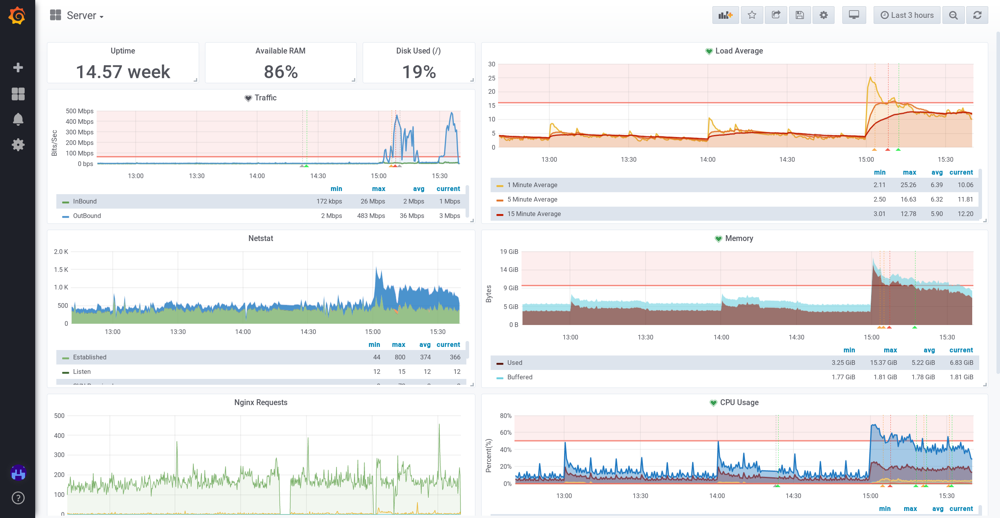

    

        

            

                

                    

                        

                            <h4>Server Early Warning System</h4>
                            <h1>Easy server monitoring</h1>
                            
Monitor your server for anomalies and get alerts instantly.

                            <a class="typeform-share button btn btn-action" href="https://daniellockyer.typeform.com/to/pCVbBZ" data-mode="popup" data-submit-close-delay="5" target="_blank">Get started</a>
                        

                    

                    

                        
                    

                

            

        

    

    

        

            

                

                    

                        

                            <i class="fas fa-6x fa-download"></i>
                        

                        

                            <h3>1. We install our software</h3>
                            
The data collector uses minimal system resources and transmits all the data we need.

                        

                    

                

                

                    

                        

                            <i class="fas fa-6x fa-mobile-alt"></i>
                        

                        

                            <h3>2. Log in to the dashboard</h3>
                            
The monitoring dashboard is accessible at any time, supporting both desktop and mobile.

                        

                    

                

                

                    

                        

                            <i class="far fa-6x fa-smile"></i>
                        

                        

                            <h3>3. Sit back and relax</h3>
                            
You will receive alerts when something needs attending to.

                        

                    

                

            

        

    

    

        

            

                

                    

                        <h2>Keep an eye on your key metrics</h2>
                        
With CPU, RAM and disk usage recorded alongside web server performance statistics, you'll get a good overview of your system.

                    

                

                

                    

                        
                    

                

            

            

                

                    

                        
                    

                

                

                    

                        <h2>Get alerts when anomalies happen</h2>
                        
Our alerting system gives email, Telegram and SMS notifications.

                    

                

            

        

    

    

        

            

                

                    

                        <h1>Our Pricing Plans</h1>
                    

                    

                         

                            

                                

                                    <h2>Enterprise</h2>
                                    $499 / month
                                    <ul>
                                        <li>Up to <b>100</b> servers</li>
                                        <li>Priority email support</li>
                                    </ul>
                                    <a class="typeform-share button btn btn-action" href="https://daniellockyer.typeform.com/to/pCVbBZ" data-mode="popup" data-submit-close-delay="5" target="_blank">Get started</a>
                                

                            

                        

                        

                            

                                

                                    <h2>Professional</h2>
                                    $299 / month
                                    <ul>
                                        <li>Up to <b>50</b> servers</li>
                                        <li>Email support</li>
                                    </ul>
                                    <a class="typeform-share button btn btn-action btn-green" href="https://daniellockyer.typeform.com/to/pCVbBZ" data-mode="popup" data-submit-close-delay="5" target="_blank">Get started</a>
                                

                            

                        

                        

                            

                                

                                    <h2>Starter</h2>
                                    $99 / month
                                    <ul>
                                        <li>Up to <b>10</b> servers</li>
                                        <li>Email support</li>
                                    </ul>
                                    <a class="typeform-share button btn btn-action" href="https://daniellockyer.typeform.com/to/pCVbBZ" data-mode="popup" data-submit-close-delay="5" target="_blank">Get started</a>
                                

                            

                        

                    

                

            

        

        

            
More than 100 servers? <a href="mailto:hi@sewsapp.com">Contact us</a> for a quote.

        

    

    

        <h1>Trusted by:</h1>
        

            
            &nbsp;
            
        

    

    

        

            

                

                    

                        

                            <h1>Frequently asked questions</h1>
                            
<a href="mailto:hi@sewsapp.com">Send us a message</a> if your question isn't listed. We'll get back to you within 24 hours.

                        

                        <h2>Is my data still secure?</h2>
                        
SEWS only collects the boring system statistics. We do not download any of your data. We may parse application logs, such as those given by Nginx &amp; PHP, in order to deliver more insight.

                        <h2>Can't I just set this up myself?</h2>
                        
Yes. We use a range of freely-available open source technologies to power the service, but it would require you to set up even more servers and software. Instead of wasting time on that, leave it to us.

                    

                

            

        

    

